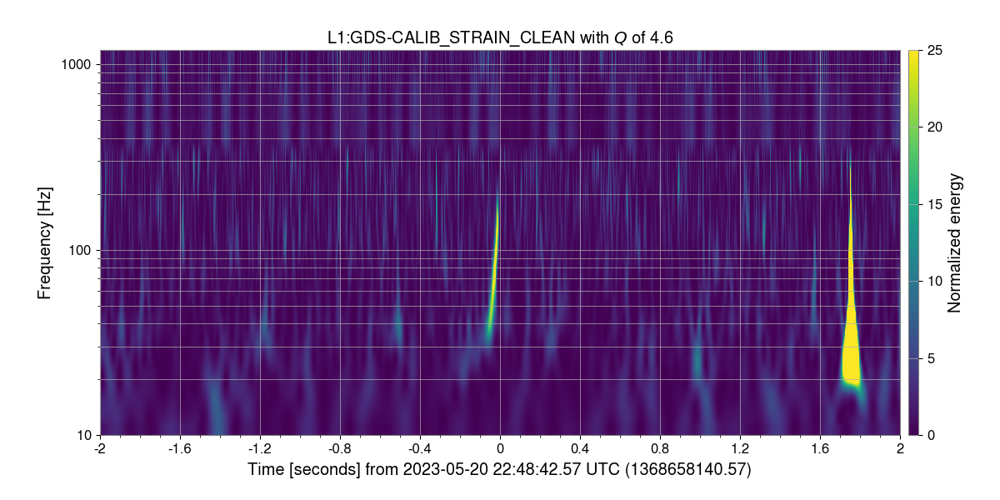
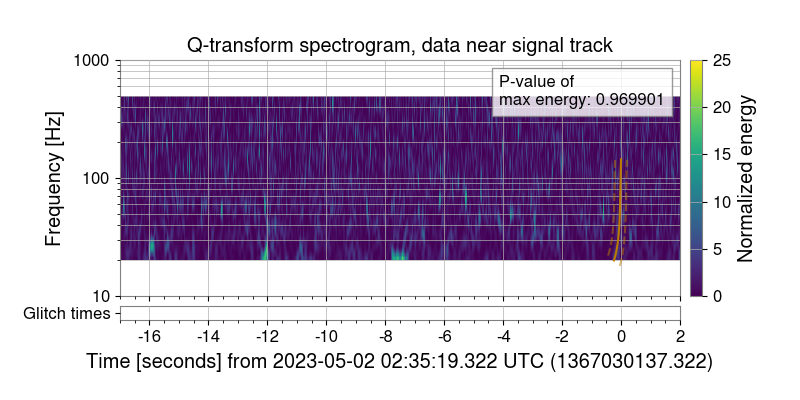

# EV forms

EV forms is a website that automates the process of communicating DetChar event validation results between different groups. To do that, the website contains forms that event validation volunteers and the noise mitigation review team should fill out. 

The website can be found [here](https://dqr.ligo.caltech.edu/ev_forms).

## Event validation form

Volunteers will be asked to fill an online event validation form with the following fields:

- Name:
- Email:
- Notes:

*Hanford*

- Validation conclusion:
	- not observing
	- no DQ issues
	- DQ issues
- Detector is in low noise:
	- No
	- Yes
<!---->
<!---->
<!---->
- Noise box start GPS time:
- Noise box end GPS time:
- Noise box f_low in Hz:
- Noise box f_high in Hz:

*Repeated for Livingston and Virgo*

There is also a GitLab issue created for each event separately. We recommend to put there your extensive event validation notes.

## Guidelines on how to fill an event validation form

**Validation conclusion**:

- Not observing — if the detector is not observing
- No DQ issues — if there are no data quality (DQ) issues, i.e. the noise boxes are empty
- DQ issues — if there are DQ issues present in any of the interferometer, i.e. any of the noise boxes are filled

**Detector is in low noise**: this can be checked from the summary pages (e.g. [link](https://ldas-jobs.ligo-la.caltech.edu/~detchar/summary/day/20230501/)) in the Lock Segments plot.

**Noise box start GPS time**: If there are glitches present in the longest OmegaScan plot from DQR, note the gpstime of the first occurrence of a glitch

**Noise box end GPS time** : If there are glitches present in the longest OmegaScan plot from DQR, note the gpstime of the last occurrence of a glitch

**Noise box f_low**: If there are glitches present in the longest OmegaScan plot from DQR, note the starting frequency of a glitch

**Noise box f_high**: If there are glitches present in the longest OmegaScan plot from DQR, note the highest frequency of a glitch

**Other recommendations**:

- Put your summarizing notes in the "Notes" field
- Post your more extensive notes from GraceDB, Detector summary pages and the data quality report to the GitLab issue
- Note any DQR task failures or any other issues -- this is useful feedback which helps to improve the DQR!
- If a DQR task fails, it does not necessarily mean that there are DQ issues. Use your own judgement! If in doubt, contact a DetChar expert of the week. 
- When looking for any excess noise, make sure you look at least +2s after the merger time. Use *omegascan*, *omega_overlap* or *glitchfind* tasks.
- As to how far back you should look from the merger time, that depends on the signal type. Use *omega_overlap* or *glitchfind* task to see the time-frequency track of the signal. BBH signals are usually short, so it is enough to look at the omegascans from *omega_overlap* and *glitchfind* tasks that plot data up to 16s before the merger time. For BNS and NSBH signals, you may need to manually produce omegascans.

For more recommendations, see the training recording and slides: [LIGO-G2300839](https://dcc.ligo.org/LIGO-G2300839).

## Examples

### Noise box 1

Here is an OmegaScan for an event at 1368658140.57 with a glitch just after it. The glitch is from +1.6 to +1.9s after the event time 1368658140.57.

Noise box properties:

- Noise box start GPS time: 1368658142.17
- Noise box end GPS time: 1368658142.47
- Noise box f_low in Hz: 15
- Noise box f_high in Hz: 350

### Noise box 2

Noises should be grouped "in boxes" if possible. Here you can see excess noise at three distinct times but there is still only one noise box.

Noise box properties:

- Noise box start GPS time: 1367030120.82
- Noise box end GPS time: 1367030130.32
- Noise box f_low in Hz: 10
- Noise box f_high in Hz: 25

### Validation notes on GitLab

We recommend posting your extensive event validation notes on the event's GitLab issue. [Here](https://git.ligo.org/detchar/event-validation/-/issues/149) are the extensive event validation notes for the [S230522n EV form](https://dqr.ligo.caltech.edu/ev_forms/summary/S230522n).

