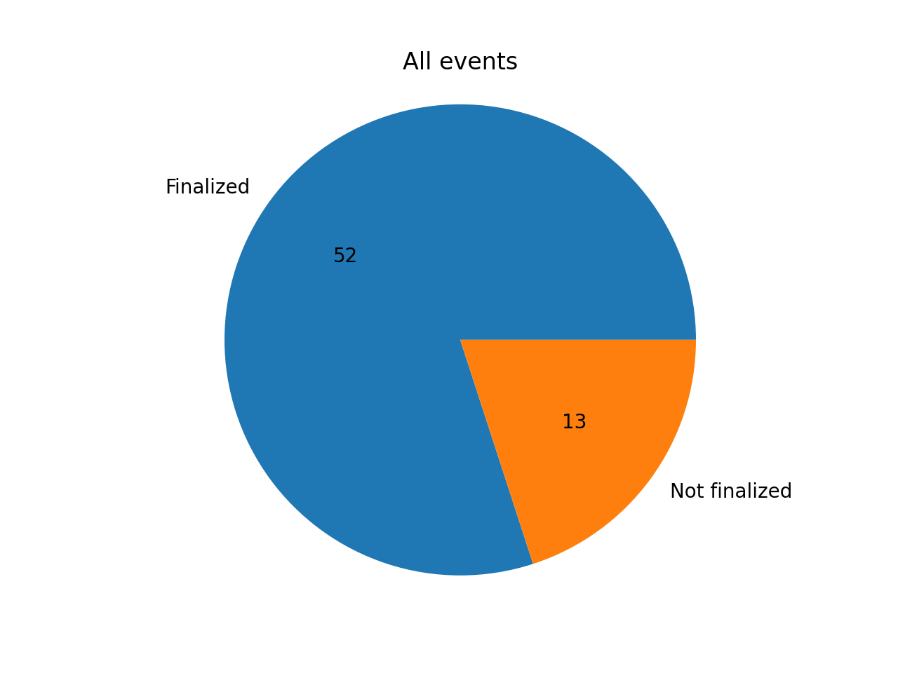
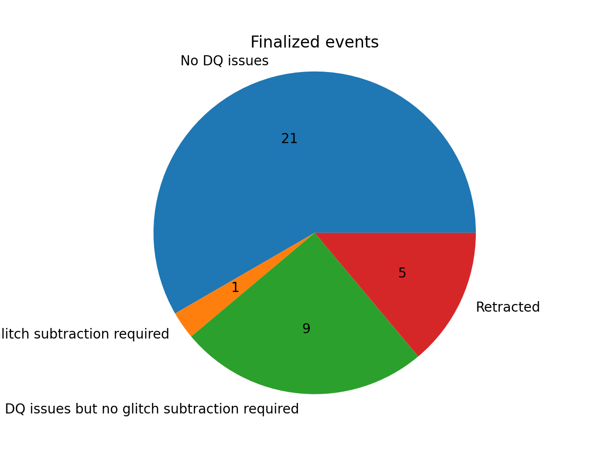
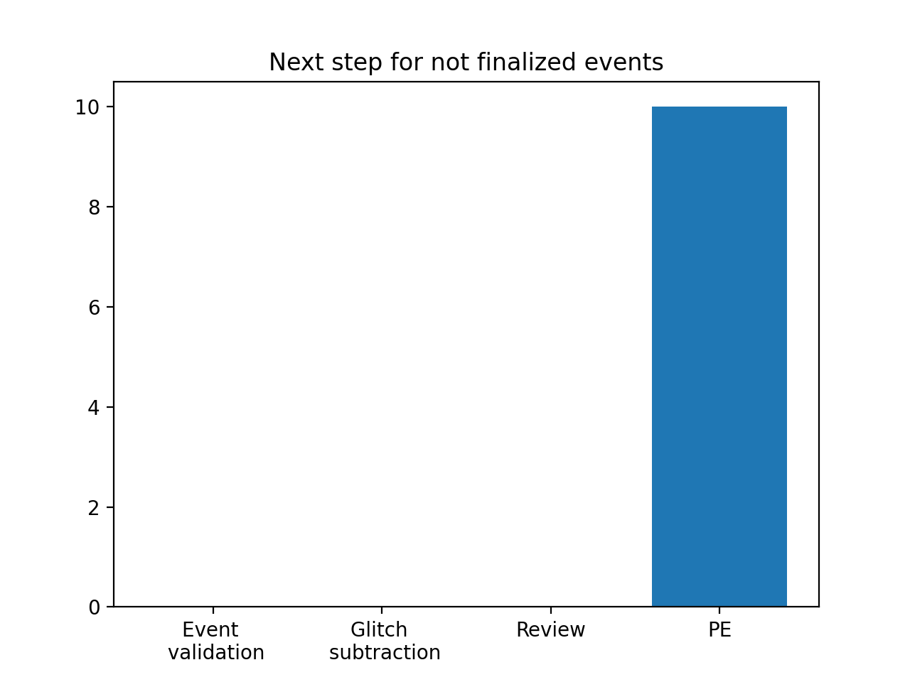

# O4a event validation

O4a starts on May 24, 2023 4pm UTC. All volunteers should have completed the training, see [the training page](training.md) for more details.

## Rota

The weekly event validation rota will consist of two volunteers and one DetChar expert. These two volunteers will be assigned 12-hour shifts for each day, i.e. they will be responsible for validating events that happened during their 12-hour shift for one week.

Sign up for the event validation rota [right here](https://docs.google.com/document/d/1KG7r8cv---d1DZ6uqUmnudz8fZ_eBrCXiIMq8UDTfXA/edit#).

Currently we split the shifts at 4pm UTC time.

| Week        | Volunteer (morning)     | Volunteer (evening) | DetChar expert | Events | DetChar presentations | Notes |
|-------------|-------------------------|---------------------|----------------|--------|-------|--------|
| May 24      | Siddharth Soni          | Ronaldas Macas          | Derek Davis    | S230524x, S230529ay | [RM](https://wiki.ligo.org/DetChar/Telecon20230612), [SS](https://wiki.ligo.org/DetChar/Telecon20230612) | Ronaldas and Sidd also validate events from ER15 (S230502m, S230518h, S230520ae, S230522a, S230522n | 
| May 31      | Shania Nichols          | Shivaraj Kandhasamy     | Andrew Lundgren| S230601bf, S230605o, S230606d |[SN](https://dcc.ligo.org/LIGO-G2301271), [SK](https://dcc.ligo.org/LIGO-G2301315) |      |
| June 7      | Alan Weinstein          | Anupreeta More          | Marissa Walker | S230608as, S230609u |       | |
| June 14     | Brennan Hughey          | Max Trevor              | Jess McIver    |        |       | |
| June 21     | Amber Stuver            | Adrian Helmling-Cornell | Laura Nuttall  | S230622ba, S230624av, S230627c |[AS](https://dcc.ligo.org/LIGO-G2301340), [AHC](https://dcc.ligo.org/LIGO-T2300247), [AHC](https://dcc.ligo.org/LIGO-T2300242)  | |
| June 28     | Caitlin Rawcliffe       | Max Trevor              | Andy Lundgren  | S230628ax, S230630am, S230630bq, S230702an, S230704f |[CR](https://dcc.ligo.org/LIGO-G2301353)       | |
| July 5      | Brennan Hughey          | Shivaraj Kandhasamy     | Jess McIver    | S230706ah, S230707ai, S230708t, S230708z, S230708cf, S230709bi | |      |
| July 12     | Zach Yarbrough          | Debasmita Nandi         | Marissa Walker |        |       | |
| July 19     | Yanyan Zheng            | Max Trevor              | Laura Nuttall  | S230723ac, S230726a |  |     |
| July 26     | Adrian Helmling-Cornell | Ronaldas Macas          | Jess McIver    | S230729z, S230731an, S230802aq | [RM](https://dcc.ligo.org/G2301496) | |
| August 2    | Yanyan Zheng            | Adrian Helmling-Cornell | Brennan Hughey | S230805x, S230806ak, S230807f, S230808i |       | |
| August 9    | Alan Weinstein          | Debasmita Nandi         | Andrew Lundgren|        |       | |
 
## Events

{!data/table_O4a.md!}

## Summary

