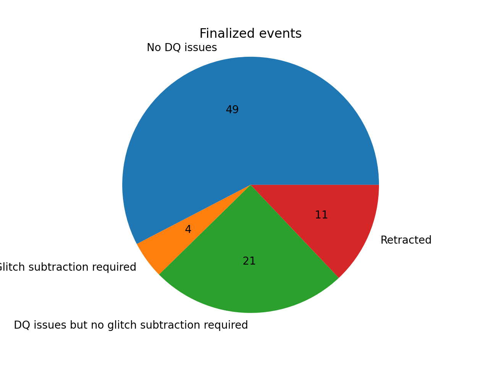

# O4a event validation

O4a starts on May 24, 2023 4pm UTC. All volunteers should have completed the training, see [the training page](training.md) for more details.

## Rota

The weekly event validation rota will consist of two volunteers and one DetChar expert. These two volunteers will be assigned 12-hour shifts for each day, i.e. they will be responsible for validating events that happened during their 12-hour shift for one week.

Sign up for the event validation rota [right here](https://docs.google.com/document/d/1KG7r8cv---d1DZ6uqUmnudz8fZ_eBrCXiIMq8UDTfXA/edit#).

Currently we split the shifts at 4pm UTC time.

| Week        | Volunteer (morning)     | Volunteer (evening) | DetChar expert | Events | DetChar presentations | Notes |
|-------------|-------------------------|---------------------|----------------|--------|-------|--------|
| May 24      | Siddharth Soni                 | Ronaldas Macas          | Derek Davis             | S230524x, S230529ay | [RM](https://wiki.ligo.org/DetChar/Telecon20230612), [SS](https://wiki.ligo.org/DetChar/Telecon20230612) | Ronaldas and Sidd also validate events from ER15 (S230502m, S230518h, S230520ae, S230522a, S230522n | 
| May 31      | Shania Nichols                 | Shivaraj Kandhasamy     | Andrew Lundgren         | S230601bf, S230605o, S230606d |[SN](https://dcc.ligo.org/LIGO-G2301271), [SK](https://dcc.ligo.org/LIGO-G2301315) |      |
| June 7      | Alan Weinstein                 | Anupreeta More          | Marissa Walker          | S230608as, S230609u | [AW](https://dcc.ligo.org/G2301716-v1), [AM](https://dcc.ligo.org/G2301733) | |
| June 14     | Brennan Hughey                 | Max Trevor              | Jess McIver             |        |       | |
| June 21     | Amber Stuver                   | Adrian Helmling-Cornell | Laura Nuttall           | S230622ba, S230624av, S230627c |[AS](https://dcc.ligo.org/LIGO-G2301340), [AHC](https://dcc.ligo.org/LIGO-T2300247), [AHC](https://dcc.ligo.org/LIGO-T2300242)  | |
| June 28     | Caitlin Rawcliffe              | Max Trevor              | Andy Lundgren           | S230628ax, S230630am, S230630bq, S230702an, S230704f |[CR](https://dcc.ligo.org/LIGO-G2301353), [MT](https://dcc.ligo.org/LIGO-G2301573) | |
| July 5      | Brennan Hughey                 | Shivaraj Kandhasamy     | Jess McIver             | S230706ah, S230707ai, S230708t, S230708z, S230708cf, S230709bi |[BH](https://dcc.ligo.org/LIGO-G2301371), [SK](https://dcc.ligo.org/LIGO-G2301500) |      |
| July 12     | Zach Yarbrough                 | Debasmita Nandi         | Marissa Walker          |        |       | |
| July 19     | Yanyan Zheng                   | Max Trevor              | Laura Nuttall           | S230723ac, S230726a |  |     |
| July 26     | Adrian Helmling-Cornell        | Ronaldas Macas          | Jess McIver             | S230729z, S230731an, S230802aq |[AHC](https://dcc.ligo.org/LIGO-T2300321), [RM](https://dcc.ligo.org/G2301496) | |
| August 2    | Yanyan Zheng                   | Adrian Helmling-Cornell | Brennan Hughey          | S230805x, S230806ak, S230807f, S230808i |[AHC](https://dcc.ligo.org/LIGO-T2300322)       | |
| August 9    | Alan Weinstein                 | Debasmita Nandi         | Andrew Lundgren         | S230811n, S230814r, S230814ah |[AW](https://dcc.ligo.org/G2301717-v1)      | |
| August 16   | Zach Yarbrough                 | Sudhagar Suyamprakasam  | Adrian HC               | S230819ax, S230820bq, S230822bm |       | |
| August 23   | Adrian Helmling-Cornell        | Jane Glanzer            | Jess McIver             | S230824r, S230825k, S230830b | [SS](https://dcc.ligo.org/DocDB/0190/G2301962/001/EV_S230824r_S230825k_S230830b.pdf) | Sudhagar S validated the events |
| August 30   | Amber Stuver                   | Shivaraj Kandhasamy     | Brennan Hughey          | S230831e, S230904n | [AS](https://dcc.ligo.org/LIGO-G2302015) | |
| Sept 6      | Manasadevi Thirugnanasambandam | Caitlin Rawcliffe       | Andrew Lundgren         | S230911ae |       | |
| Sept 13     | Samuel Salvador                | Dishari Malakar         | Adrian Helmling-Cornell | S230914ak, S230919bj, S230920al | [DM](https://dcc.ligo.org/G2301996)  | |
| Sept 20     | Sudhagar Suyamprakasam         | Anupreeta More          | Derek Davis             | S230922g, S230922q, S230924an, S230927li, S230927be |       | |
| Sept 27     | Tabata Ferreira                | Tabata Ferreira         | Jess McIver             | S230928cb, S230930al, S231001aq |       | |
| Oct 4       | Shivaraj Kandhasamy            | Shivaraj Kandhasamy     | Laura Nuttall           |        |       | |
 
## Events

{!data/table_O4a.md!}

## Summary

