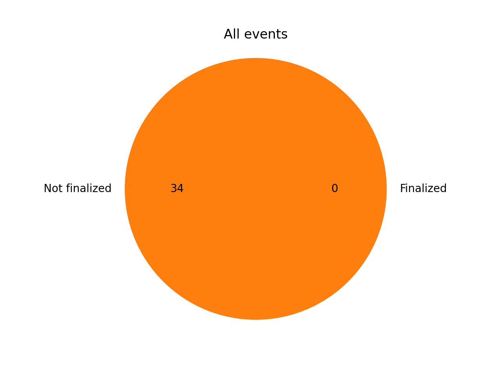
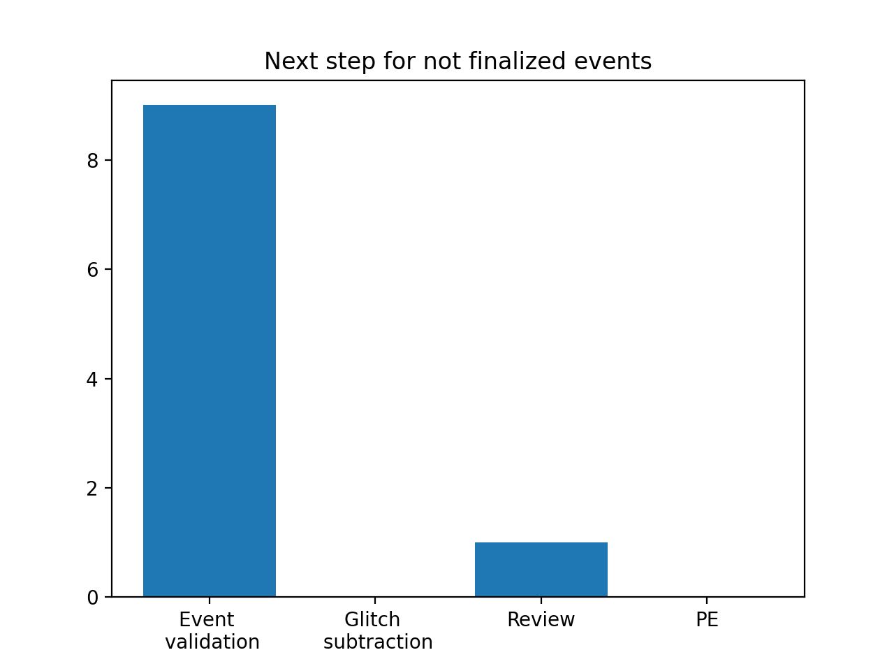

# O4b event validation

O4b starts on April 10, 2024, at 15:00 UTC. All volunteers should have completed the training, see [the training page](training.md) for more details.

## Rota

The weekly event validation rota will consist of one volunteer and two DetChar experts. The 12h division of the daily shifts, in place during the first part of O4a, is discontinued until further notice and the rate of events will increase significantly. Instead, since ER16, there are 12h shifts of Detchar experts every day. Refer to the columns M and O of the [RRT LVK Site Advocates and Detchar spreadheet](https://docs.google.com/spreadsheets/d/1MD9o4GlT5iW2oP5QWUt_T1UMVc2CbzizigK76fc8fr4/edit#gid=1967048006).

Each shifter will be responsible for validating the events that happened during their week.

Sign up for the event validation rota [right here](https://docs.google.com/document/d/1KG7r8cv---d1DZ6uqUmnudz8fZ_eBrCXiIMq8UDTfXA/edit#).

| Week        | Volunteer (main)        | Volunteer (backup)  | DetChar expert | Events | DetChar presentations | Notes |
|-------------|-------------------------|---------------------|----------------|--------|-------|--------|
| April 3     | Samuel Salvador         |                     | Derek Davis, Francesco Di Renzo | [S240406aj](https://gracedb.ligo.org/superevents/S240406aj/view/) | [SS](https://dcc.ligo.org/G2400982) | ER16 |
| April 10    | Beverly Berger          |                     | Derek Davis, Francesco Di Renzo| [S240413p](https://gracedb.ligo.org/superevents/S240413p/view/) |  |    | 
| April 17    | Adrian Helmling-Cornell |                     | Jess McIver, Francesco Di Renzo | [S240420aw](https://gracedb.ligo.org/superevents/S240420aw/view/) [R], [S240421ar](https://gracedb.ligo.org/superevents/S240421ar/view/), [S240422ed](https://gracedb.ligo.org/superevents/S240422ed/view/), [S240423br](https://gracedb.ligo.org/superevents/S240423br/view/) [R] |       |        |
| April 24    | Dishari Malakar         |                     | Brennan Hughey, Francesco Di Renzo |        |       |        |
| May 1       | Yanyan Zheng            |                     |                |        |       |        |
| May 8       | Anupreeta More          |                     |                |        |       |        |
| May 15      | Samuel Salvador         |                     |                |        |       |        |
| May 22      | Amber Stuver            |                     |                |        |       |        |
| May 29      | Dishari Malakar         |                     |                |        |       |        |
| June 5      | Alan Weinstein          |                     |                |        |       |        |
| June 12     |                         |                     |                |        |       |        |

## Events

{!data/table_O4b.md!}

## Summary

