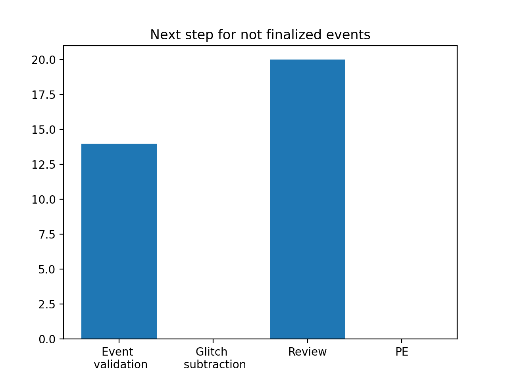

# O4b event validation

O4b starts on April 10, 2024, at 15:00 UTC. All volunteers should have completed the training, see [the training page](training.md) for more details.

## Rota

The weekly event validation rota will consist of one volunteer and two DetChar experts. The 12h division of the daily shifts, in place during the first part of O4a, is discontinued until further notice and the rate of events will increase significantly. Instead, since ER16, there are 12h shifts of Detchar experts every day. Refer to the columns M and O of the [RRT LVK Site Advocates and Detchar spreadheet](https://docs.google.com/spreadsheets/d/1MD9o4GlT5iW2oP5QWUt_T1UMVc2CbzizigK76fc8fr4/edit#gid=1967048006).

Each shifter will be responsible for validating the events that happened during their week.

Sign up for the event validation rota [right here](https://docs.google.com/document/d/1KG7r8cv---d1DZ6uqUmnudz8fZ_eBrCXiIMq8UDTfXA/edit#).

| Week        | Volunteer (main)        | Volunteer (backup)  | DetChar expert | Events | DetChar presentations | Notes |
|-------------|-------------------------|---------------------|----------------|--------|-------|--------|
| April 3     | Samuel Salvador         |                     | Derek Davis, Francesco Di Renzo | [S240406aj](https://gracedb.ligo.org/superevents/S240406aj/view/) | [SS](https://dcc.ligo.org/G2400982) | ER16 |
| April 10    | Beverly Berger          |                     | Derek Davis, Francesco Di Renzo| [S240413p](https://gracedb.ligo.org/superevents/S240413p/view/) |  |    | 
| April 17    | Adrian Helmling-Cornell |                     | Jess McIver, Francesco Di Renzo | [S240420aw](https://gracedb.ligo.org/superevents/S240420aw/view/) [R], [S240421ar](https://gracedb.ligo.org/superevents/S240421ar/view/), [S240422ed](https://gracedb.ligo.org/superevents/S240422ed/view/), [S240423br](https://gracedb.ligo.org/superevents/S240423br/view/) [R] | [AHC](https://dcc.ligo.org/G2401050) |        |
| April 24    | Dishari Malakar         |                     | Brennan Hughey, Francesco Di Renzo | [S240426s](https://gracedb.ligo.org/superevents/S240426s/view/), [S240426dl](https://gracedb.ligo.org/superevents/S240426dl/view/), [S240428dr](https://gracedb.ligo.org/superevents/S240428dr/view/), [S240429an](https://gracedb.ligo.org/superevents/S240429an/view/) [R], [S240430ca](https://gracedb.ligo.org/superevents/S240430ca/view/) | [DM](https://dcc.ligo.org/G2401049)  |        |
| May 1       | Yanyan Zheng            |                     | Derek Davis, Francesco Di Renzo | [S240501an](https://gracedb.ligo.org/superevents/S240501an/view/), [S240505av](https://gracedb.ligo.org/superevents/S240505av/view/), [S240507p](https://gracedb.ligo.org/superevents/S240507p/view/)       |       |        |
| May 8       | Anupreeta More          |                     | Adrian Helmling-Cornell, Francesco Di Renzo | [S240511i](https://gracedb.ligo.org/superevents/S240511i/view/), [S240512r](https://gracedb.ligo.org/superevents/S240512r/view/), [S240513ei](https://gracedb.ligo.org/superevents/S240513ei/view/), [S240514c](https://gracedb.ligo.org/superevents/S240514c/view/), [S240514x](https://gracedb.ligo.org/superevents/S240514x/view/) |       |        |
| May 15      | Samuel Salvador         |                     | Brennan Hughey, Francesco Di Renzo | [S240515m](https://gracedb.ligo.org/superevents/S240515m/view/), [S240520cv](https://gracedb.ligo.org/superevents/S240520cv/view/) |       |        |
| May 22      | Amber Stuver            |    | Jess McIver, Francesco Di Renzo | [S240525p](https://gracedb.ligo.org/superevents/S240525p/view/), [S240527en](https://gracedb.ligo.org/superevents/S240527en/view/), [S240527fv](https://gracedb.ligo.org/superevents/S240527fv/view/)       |       |        |
| May 29      | Dishari Malakar      |   | Jess McIver, Francesco Di Renzo | [S240530a](https://gracedb.ligo.org/superevents/S240530a/view/), [S240531bp](https://gracedb.ligo.org/superevents/S240531bp/view/), [S240601aj](https://gracedb.ligo.org/superevents/S240601aj/view/), [S240601co](https://gracedb.ligo.org/superevents/S240601co/view/) |        |       | 
| June 5      | Alan Weinstein          |                     | Francesco Di Renzo |        |       |        |
| June 12     | Soorya Narayan          |                     | Brennan Hughey, Francesco Di Renzo |        |       |        |
| June 19     | Shivaraj Kandhasamy     |                     | ..., Francesco Di Renzo |        |       |        |
| June 26     | Adrian Helmling-Cornell |                     | ..., Francesco Di Renzo |        |       |        |
| July 3      | Airene Ahuja            |                     |                |        |       | Shadow: Alan Knee |
| July 10      | Sudhagar Suyamprakasam |                     |                |        |       |        |
| July 17      | Samuel Salvador        |                     |                |        |       |        |
| July 24      | Airene Ahuja           |                     |                |        |       |        |
| July 31      | Alan Knee              |                     |                |        |       |        |
| August 7     | Dishari Malakar        |                     |                |        |       |        |

## Events

{!data/table_O4b.md!}

## Summary

